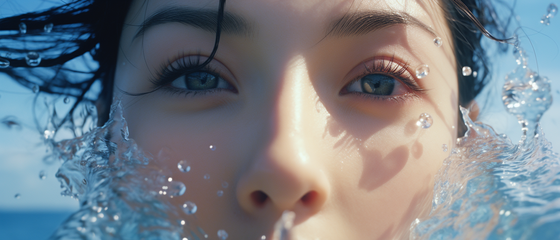
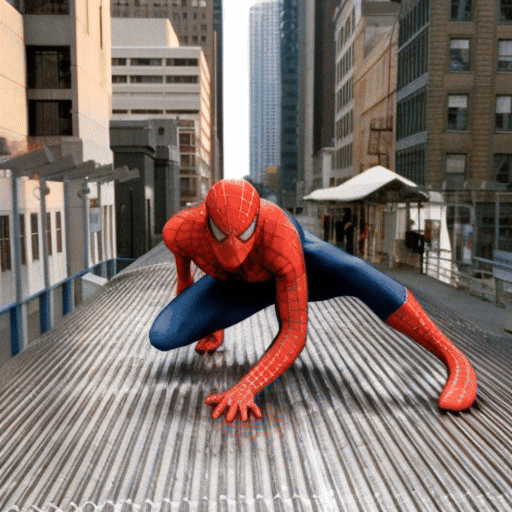

# SEINE
[](https://arxiv.org/abs/2310.20700)
[](https://vchitect.github.io/SEINE-project/)
[](https://replicate.com/lucataco/seine) 
[](https://huggingface.co/spaces/Vchitect/SEINE)
[](https://hits.seeyoufarm.com)

This repository is the official implementation of [SEINE](https://arxiv.org/abs/2310.20700):

**[SEINE: Short-to-Long Video Diffusion Model for Generative Transition and Prediction (ICLR2024)](https://arxiv.org/abs/2310.20700)**

**SEINE** is a video diffusion model and is part of the video generation system [Vchitect](http://vchitect.intern-ai.org.cn/). 
You can also check our Text-to-Video (T2V) framework [LaVie](https://github.com/Vchitect/LaVie).


##  Setup

### Prepare Environment
```
conda create -n seine python==3.9.16
conda activate seine
pip install -r requirement.txt
```

### Download our model and T2I base model

Our model is based on Stable diffusion v1.4, you may download [Stable Diffusion v1-4](https://huggingface.co/CompVis/stable-diffusion-v1-4) to the director of ``` pretrained ```
.
Download our model checkpoint (from [google drive](https://drive.google.com/drive/folders/1cWfeDzKJhpb0m6HA5DoMOH0_ItuUY95b?usp=sharing) or [hugging face](https://huggingface.co/xinyuanc91/SEINE/tree/main)) and save to the directory of ```pretrained```


Now under `./pretrained`, you should be able to see the following:
```
├── pretrained
│   ├── seine.pt
│   ├── stable-diffusion-v1-4
│   │   ├── ...
└── └── ├── ...
        ├── ...
```
## Usage
### Inference for I2V 
Run the following command to get the I2V results:
```python
python sample_scripts/with_mask_sample.py --config configs/sample_i2v.yaml
```
The generated video will be saved in ```./results/i2v```.

#### More Details
You may modify ```./configs/sample_i2v.yaml``` to change the generation conditions.
For example:

```ckpt``` is used to specify a model checkpoint.

```text_prompt``` is used to describe the content of the video.

```input_path``` is used to specify the path to the image.

### Inference for Transition
```python
python sample_scripts/with_mask_sample.py --config configs/sample_transition.yaml
```
The generated video will be saved in ```./results/transition```.


## Results
### I2V Results
<table class="center">
<tr>
  <td style="text-align:center;width: 50%" colspan="1"><b>Input Image</b></td>
  <td style="text-align:center;width: 50%" colspan="1"><b>Output Video</b></td>
</tr>
<tr>
  <td></td>
  <td></td>
</tr>

<tr>
  <td></td>
  <td></td>
</tr>

<tr>
  <td></td>
  <td></td>
</tr>

</table>


### Transition Results
<table>
<tr>
  <td style="text-align:center;width: 66%" colspan="2"><b>Input Images</b></td>
  <td style="text-align:center;width: 33%" colspan="1"><b>Output Video</b></td>
</tr>
<tr>
  <td></td>
  <td></td>
  <td></td>
</tr>
<tr>
  <td></td>
  <td></td>
  <td></td>
</tr>

</table>

## BibTeX
```bibtex
@inproceedings{chen2023seine,
  title={Seine: Short-to-long video diffusion model for generative transition and prediction},
  author={Chen, Xinyuan and Wang, Yaohui and Zhang, Lingjun and Zhuang, Shaobin and Ma, Xin and Yu, Jiashuo and Wang, Yali and Lin, Dahua and Qiao, Yu and Liu, Ziwei},
  booktitle={ICLR},
  year={2023}
}
```

```bibtex
@article{wang2023lavie,
  title={LAVIE: High-Quality Video Generation with Cascaded Latent Diffusion Models},
  author={Wang, Yaohui and Chen, Xinyuan and Ma, Xin and Zhou, Shangchen and Huang, Ziqi and Wang, Yi and Yang, Ceyuan and He, Yinan and Yu, Jiashuo and Yang, Peiqing and others},
  journal={IJCV},
  year={2024}
}
```

## Disclaimer
We disclaim responsibility for user-generated content. The model was not trained to realistically represent people or events, so using it to generate such content is beyond the model's capabilities. It is prohibited for pornographic, violent and bloody content generation, and to generate content that is demeaning or harmful to people or their environment, culture, religion, etc. Users are solely liable for their actions. The project contributors are not legally affiliated with, nor accountable for users' behaviors. Use the generative model responsibly, adhering to ethical and legal standards.

## Contact Us
**Xinyuan Chen**: [chenxinyuan@pjlab.org.cn](mailto:chenxinyuan@pjlab.org.cn)
**Yaohui Wang**: [wangyaohui@pjlab.org.cn](mailto:wangyaohui@pjlab.org.cn)  

## Acknowledgements
The code is built upon [LaVie](https://github.com/Vchitect/LaVie), [diffusers](https://github.com/huggingface/diffusers) and [Stable Diffusion](https://github.com/CompVis/stable-diffusion), we thank all the contributors for open-sourcing. 


## License
The code is licensed under Apache-2.0, model weights are fully open for academic research and also allow **free** commercial usage. To apply for a commercial license, please contact vchitect@pjlab.org.cn.
